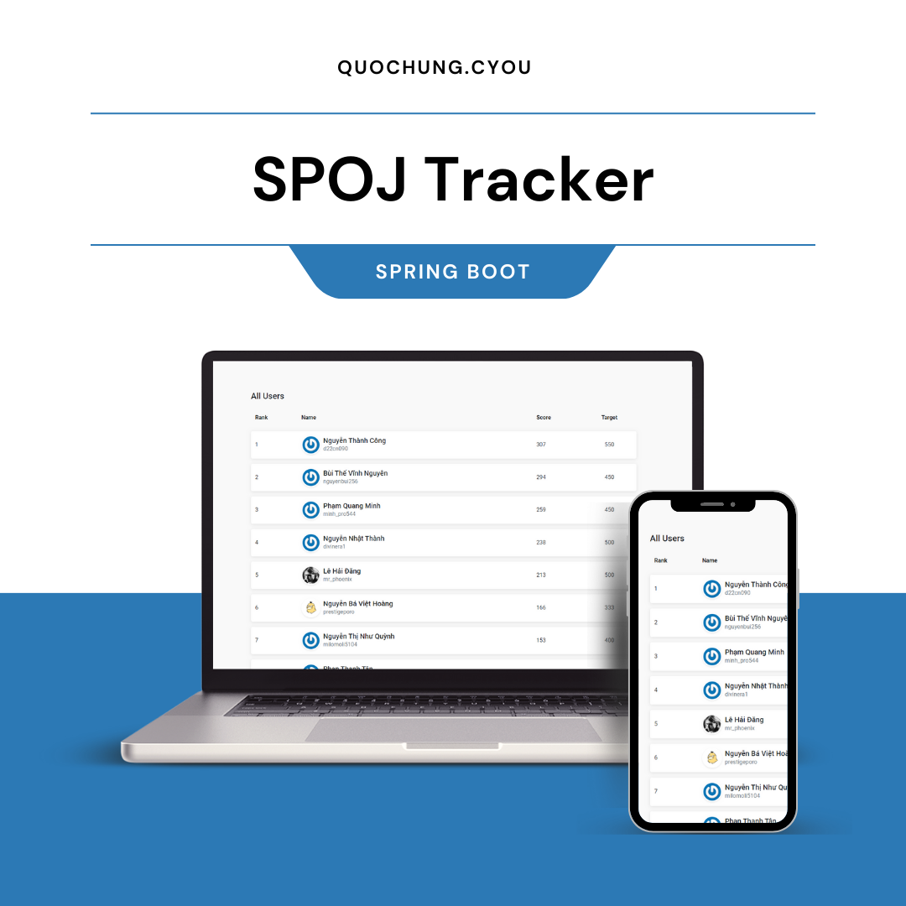

# SPOJ Tracker (Spring)

## Author

* quochungcyou

## Description

* SPOJ Tracker Application for ProPTIT. Made in Spring Boot with HTML/Css Front-end (Thymeleaf)
My first attempt to make Spring Application and Learn Docker

Demo link: https://springspoj.quochung.cyou/


### Structure
Built on MVC
- JsoupHelper: Multi-Thread crawler singleton to SPOJ site and save data to json format (Gson) at static/username.json
- MainController: Handle the request and return static html page at /template/home.html
- Model/Player: User model with username, fullname etc

### Prerequisites


* To run this software, you need an editor with java support, java - version 17 or higher
* Install java 17 using the commands:
https://docs.aws.amazon.com/corretto/latest/corretto-17-ug/amazon-linux-install.html

## Build the application
* ./gradlew bootjar 
* docker build springspoj . 
* docker run -p 8080:8080 springspoj 

Now the web available at http://localhost:8080
### Setup

* Clone the project
* Open in android-studio


## Technologies Used

* Java (version 17)
* Gradle
* Jsoup
* Gson
* Docker
* Spring Boot
* Thymeleaf


## Demo image



## License Information

* This software is licensed under MIT License.
* [Read More](https://choosealicense.com/licenses/mit/) on the license.


```
MIT License

Copyright (c) 2023 QuocHung

Permission is hereby granted, free of charge, to any person obtaining a copy
of this software and associated documentation files (the "Software"), to deal
in the Software without restriction, including without limitation the rights
to use, copy, modify, merge, publish, distribute, sublicense, and/or sell
copies of the Software, and to permit persons to whom the Software is
furnished to do so, subject to the following conditions:

The above copyright notice and this permission notice shall be included in all
copies or substantial portions of the Software.

THE SOFTWARE IS PROVIDED "AS IS", WITHOUT WARRANTY OF ANY KIND, EXPRESS OR
IMPLIED, INCLUDING BUT NOT LIMITED TO THE WARRANTIES OF MERCHANTABILITY,
FITNESS FOR A PARTICULAR PURPOSE AND NONINFRINGEMENT. IN NO EVENT SHALL THE
AUTHORS OR COPYRIGHT HOLDERS BE LIABLE FOR ANY CLAIM, DAMAGES OR OTHER
LIABILITY, WHETHER IN AN ACTION OF CONTRACT, TORT OR OTHERWISE, ARISING FROM,
OUT OF OR IN CONNECTION WITH THE SOFTWARE OR THE USE OR OTHER DEALINGS IN THE
SOFTWARE.
```
